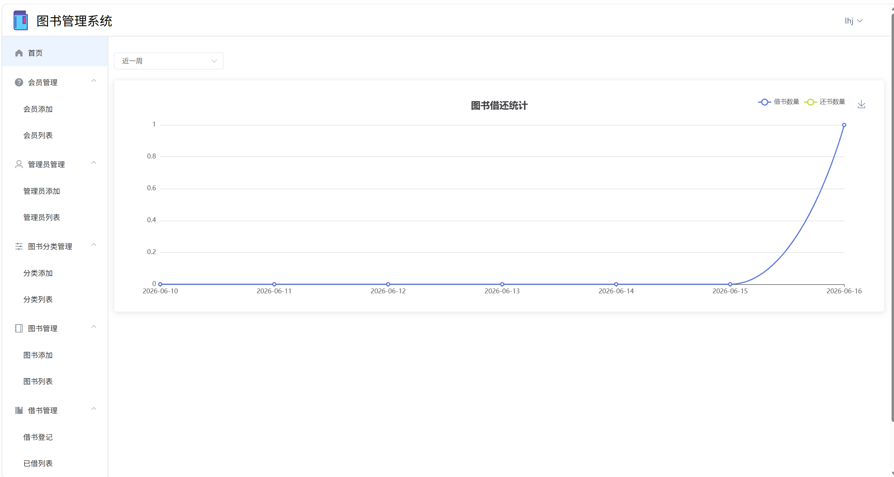
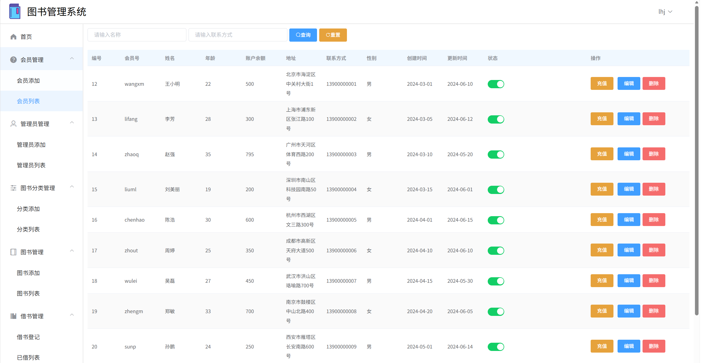
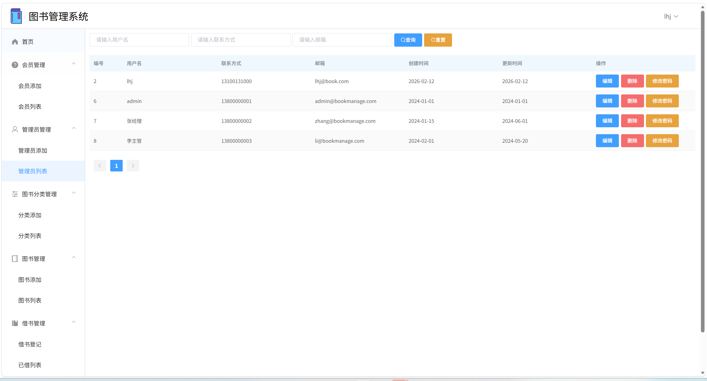
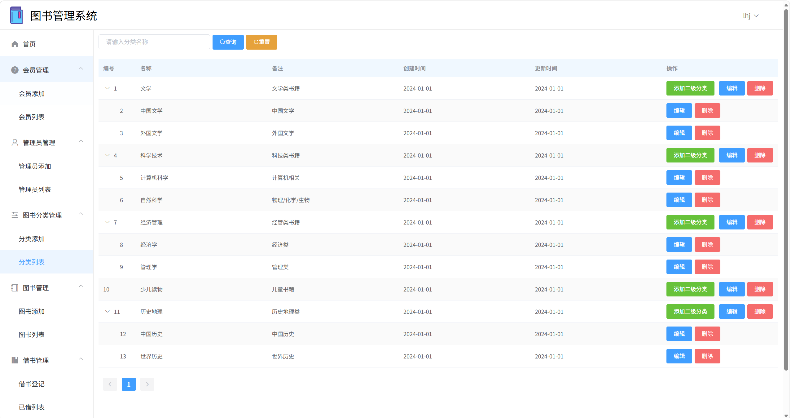
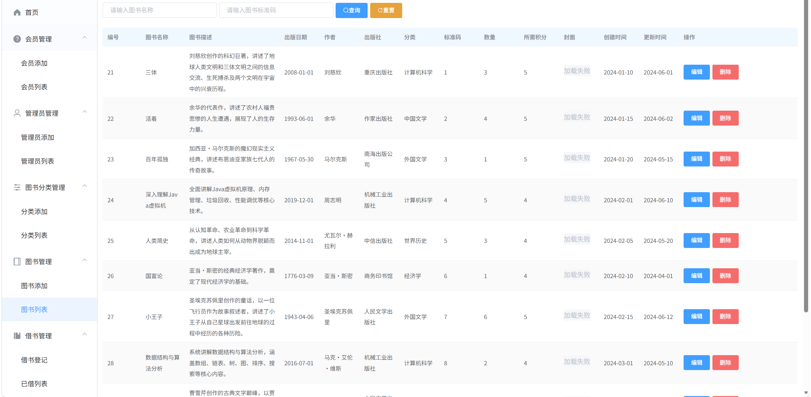
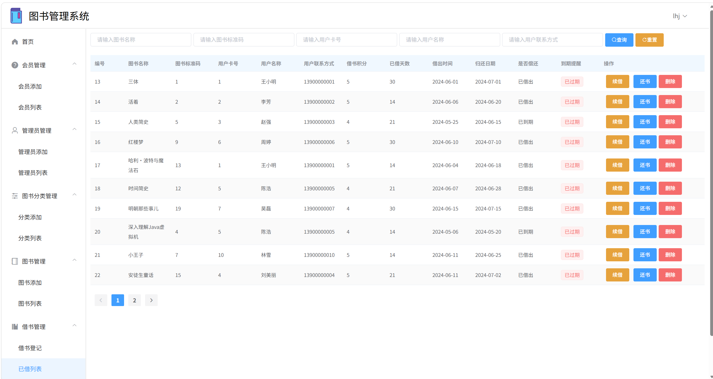
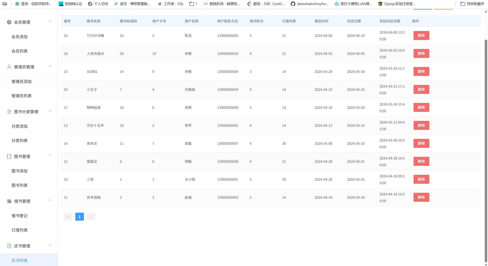

# 图书管理系统 (BookManagementDemo)

基于 **Spring Boot 3.2 + Vue 2 + MySQL** 的前后端分离图书管理系统，涵盖图书、会员、管理员、分类、借书、还书等核心业务模块。

---

## 项目结构

```
BookManagementDemo/
├── src/                          # 后端源码 (Spring Boot)
│   ├── main/
│   │   ├── java/com/lhj/bookmanagementdemo/
│   │   │   ├── common/           # 通用配置（跨域、JWT拦截、统一响应）
│   │   │   ├── controller/       # API 控制器
│   │   │   ├── entity/           # 数据实体
│   │   │   ├── exception/        # 全局异常处理
│   │   │   ├── mapper/           # MyBatis Mapper 接口
│   │   │   ├── service/          # 业务逻辑层
│   │   │   └── utils/            # 工具类（JWT Token 工具）
│   │   └── resources/
│   │       ├── mapper/           # MyBatis XML 映射文件
│   │       └── application.yml   # 应用配置
│   └── pom.xml
├── book-vue/                     # 前端项目 (Vue 2 + Element UI)
│   ├── src/
│   │   ├── views/                # 页面组件
│   │   │   ├── admin/            # 管理员管理
│   │   │   ├── book/             # 图书管理
│   │   │   ├── borrow/           # 借书管理
│   │   │   ├── category/         # 图书分类
│   │   │   ├── user/             # 会员管理
│   │   │   ├── retur/            # 还书管理
│   │   │   ├── login/            # 登录
│   │   │   └── home/             # 首页
│   │   ├── router/               # 路由配置
│   │   ├── utils/                # 工具（Axios 封装）
│   │   └── assets/               # 静态资源
│   ├── package.json
│   └── vue.config.js
└── README.md
```

---

## 技术栈

### 后端

| 技术 | 版本 |
|------|------|
| Java | 17 |
| Spring Boot | 3.2.1 |
| MyBatis | 3.0.3 |
| MySQL | 8.x |
| PageHelper | 2.1.0 |
| JWT (Auth0) | 4.4.0 |
| Lombok | - |
| Hutool | 5.8.22 |
| Spring Security Crypto | - |
| Maven | - |

### 前端

| 技术 | 版本 |
|------|------|
| Vue | 2.6.14 |
| Element UI | 2.15.14 |
| Vue Router | 3.5.1 |
| Axios | 1.13.4 |
| js-cookie | 3.0.5 |
| SlideVerify | vue-monoplasty-slide-verify |
| Vue CLI | 5 |

---

## 快速开始

### 环境要求

- JDK 17+
- Maven 3.6+
- Node.js 16+
- MySQL 8.0+

### 1. 数据库初始化

创建数据库 `bookmanagementdemo`，导入项目中的 SQL 脚本（如已提供）或根据实体类自动建表。

### 2. 启动后端

```bash
# 修改 src/main/resources/application.yml 中的数据库连接信息
cd BookManagementDemo
mvn spring-boot:run
```

后端服务默认启动在 `http://localhost:2222`

### 3. 启动前端

```bash
cd book-vue
npm install
npm run serve
```

前端服务默认启动在 `http://localhost:8080`

---

## 功能模块

| 模块 | 说明 |
|------|------|
| 管理员管理 | 管理员账号的增删改查 |
| 会员管理 | 会员信息的增删改查 |
| 图书分类 | 支持父子级树形结构的分类管理 |
| 图书管理 | 图书的增删改查（含封面、评分、库存） |
| 借书管理 | 借书登记、续借、到期提醒 |
| 还书管理 | 还书记录、逾期记录查看 |
| 登录认证 | JWT Token + 滑块验证码双重验证 |

---

## API 接口

所有接口以 `http://localhost:2222/api` 为基路径，请求需在 Header 中携带 `token` 字段进行身份验证。

### 接口概览

| 方法 | 路径 | 说明 |
|------|------|------|
| POST | `/api/admin/login` | 管理员登录 |
| GET/POST | `/api/admin/**` | 管理员管理 |
| GET/POST | `/api/user/**` | 会员管理 |
| GET/POST | `/api/book/**` | 图书管理 |
| GET/POST | `/api/category/**` | 图书分类 |
| GET/POST | `/api/borrow/**` | 借书管理 |
| GET/POST | `/api/retur/**` | 还书管理 |

---

## 安全机制

- **JWT Token 认证**：登录成功后生成 token，后续请求需在 Header 中携带
- **密码加密**：使用 Spring Security Crypto 进行密码加密存储
- **滑块验证码**：登录页面集成滑块验证，防止自动化登录
- **JWT 拦截器**：全局拦截非法请求，返回 401 状态码
- **全局异常处理**：统一异常拦截，规范错误响应格式

---

## 统一响应格式

所有接口返回统一的 JSON 格式：

```json
{
  "code": 200,
  "msg": "操作成功",
  "data": {}
}
```

---

## 开发说明

- 后端遵循 **Controller → Service → Mapper** 分层架构
- 前端使用 **Element UI** 组件库，基于 Layout 布局实现侧边栏导航
- 分页查询使用 **PageHelper** 插件
- 跨域配置已在后端 `CorsConfig` 中处理

## 示例截图







